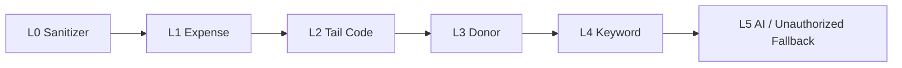

# AGENTS.md

## What this is

Pure client-side static site (HTML + vanilla JS + CSS). **No build system, no package.json, no bundler, no transpilation.** JS runs as native ES modules in the browser.

Deploys to GitHub Pages via GitHub Actions and Vercel.

## Commands

```bash
# Local dev server (zero deps, port 5174, auto-increments if busy)
node serve.mjs

# Unit tests (Node.js ESM, no framework — uses node:assert)
node test/run_tests.js
```

CI runs `node test/run_tests.js` on Node 20 before deploying to GitHub Pages. Tests must pass.

## Architecture

Two HTML entry points:
- `index.html` — landing page (marketing)
- `app.html` — main SPA application (converter)

Clean URL: `/app` serves `app.html` (via `serve.mjs` rewrite + `vercel.json`).

### 5-Layer Classification Pipeline (`js/engine/classifier.js`)



- L0: Strip bank noise (BI-FAST/RTGS/QRIS), extract sender name, filter company aliases
- L1: Negative amount or "TRF KE" → expense COA 60100008
- L2: Match last-3-digits of amount to program tail codes
- L3: Match sender name to registered donors
- L4: Match keywords in label to programs
- L5: AI semantic (optional, Ollama/Gemini/OpenAI) or fallback to 40201000 Unauthorized

### Key source files

| Path | Role |
|------|------|
| `js/engine/sanitizer.js` | L0 text cleaning, input sanitizers (`sanitizeInputText`, `sanitizeSlug`, `sanitizePhone`, `sanitizeCoaCode`) |
| `js/engine/classifier.js` | `classifySingle()`, `classifyBatch()` — the 5-layer pipeline |
| `js/engine/ai_matcher.js` | L5 AI integration (Ollama, Gemini, OpenAI) |
| `js/services/excel_adapter.js` | XLSX/CSV parsing + SIAK export |
| `js/store/master_store.js` | Master data (COA, programs, donors, aliases) in localStorage |
| `js/store/session_store.js` | Transaction rows, filtering, pagination, sorting |
| `js/config/default_presets.js` | Default master data (`DEFAULT_MASTER_DATA`) |
| `js/vendor/xlsx.full.min.js` | Vendored SheetJS — **do not replace without checking tests** |
| `js/app.js` | Main app logic (~2200 lines, single file) |
| `js/landing.js` | Landing page interactivity |

### CSS

| Path | Scope |
|------|-------|
| `css/style.css` | Core app styles, design tokens, dark/light theme |
| `css/components.css` | UI components (modals, tables, badges, toasts) |
| `css/landing.css` | Landing page specific |

## Testing

Tests are in `test/run_tests.js`. No test framework — just `node:assert` + manual pass/fail tracking.

**Test structure:**
1. Load vendored XLSX via `createRequire` into `globalThis.XLSX`
2. Import engine modules directly (ESM)
3. Run assertions for: sanitizer, classifier routing, input sanitizers, master store CRUD, session store operations

**Critical:** Engine modules (`classifier.js`, `sanitizer.js`) use `globalThis.XLSX` internally. Tests set this up via `createRequire` before importing. If you add XLSX-dependent code to engine modules, ensure tests still load XLSX first.

**E2E parity check** (lines 381-433): Compares `sample/inputt.xlsx` → classified output against `sample/output.xlsx` golden file. Files are in `.gitignore` (`sample/`), so this test is skipped when absent. Parity ≥50% required.

**Adding tests:** Add `await ok("test name", () => { ... })` blocks. The `ok` function wraps assertions in promises and tracks pass/fail counts. Tests run serially.

## Deployment

- **GitHub Pages:** Push to `main`/`master` triggers `.github/workflows/deploy.yml` → test → deploy
- **Vercel:** `vercel.json` configures clean URLs, rewrites (`/app` → `app.html`), and security headers (CSP, X-Frame-Options, etc.)
- **Deployment target:** Entire repo root (no `dist/` or `build/` step)

## Gotchas

- **localStorage keys are versioned:** `ziswaf_demo_session_rows_v1`, `ziswaf_theme`, `ziswaf_active_page`, `ziswaf_active_subtab`. Renaming breaks user data continuity.
- **Theme flash prevention:** Inline `<script>` in `<head>` of both HTML files reads `localStorage('ziswaf_theme')` before body renders. Do not remove or defer these.
- **Page state preservation:** `app.html` sets `data-active-step` attribute on `<html>` in head script to prevent layout flash on refresh.
- **CSP meta tags:** Both HTML files have inline `Content-Security-Policy` meta tags whitelisting specific origins (Ollama `localhost:11434`, Gemini, OpenAI, OpenRouter). If you add external resources, update CSP in **both** `index.html` and `app.html`.
- **No npm install needed.** All dependencies are either vendored (`xlsx.full.min.js`) or loaded from CDN (Font Awesome, Google Fonts) with CSP exceptions.
- **`serve.mjs` is zero-dependency.** Uses only `node:http`, `node:fs/promises`, `node:path`, `node:url`. Port auto-increments from 5174 (up to 10 retries).
- **`sample/` directory is gitignored** but referenced by the E2E parity test. It contains test fixtures not committed to the repo.
- **UI language is Indonesian (id).** All user-facing strings, labels, and error messages are in Bahasa Indonesia.