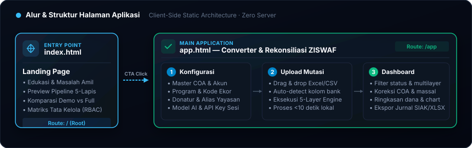
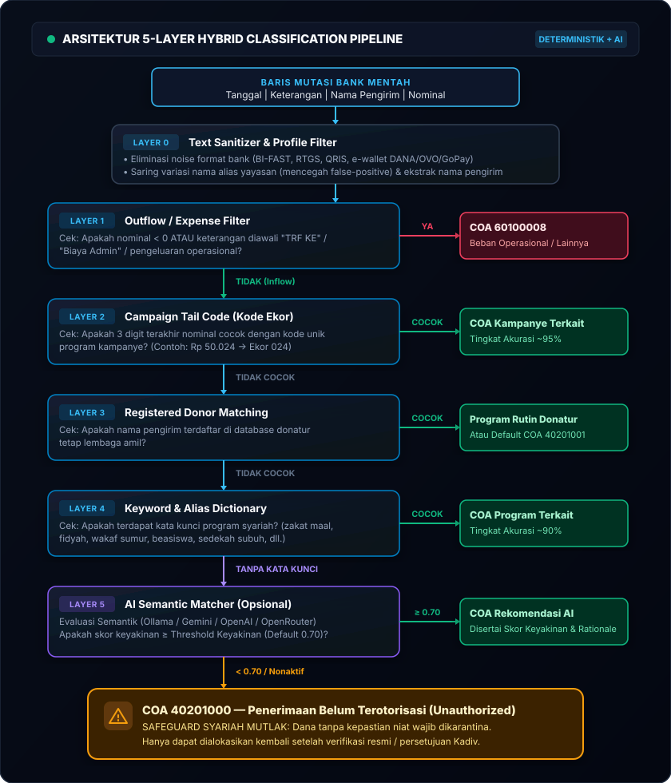

# ZISWAFier Lite — Smart Inflow Classifier (Client-Side Demo)

[](https://github.com/ImamWahyudiz/ziswafierlite/actions/workflows/deploy.yml)


> 🚀 **LIVE DEMO**: Kunjungi aplikasi langsung di **[https://ImamWahyudiz.github.io/ziswafierlite/](https://ziswafierlite.vercel.app/app)**

---

> ℹ️ **PENTING — TENTANG VERSI INI**:
> Repositori ini (**`ziswafierlite`**) adalah **versi demonstrasi mandiri (Interactive Client-Side Demo)** dari sistem enterprise **[ZISWAFier (ZISWAF Smart Inflow Classifier & Reconciliation System)](https://github.com/ImamWahyudiz/ziswafier)**.
>
> Versi **Lite** ini dibuat agar lembaga amil, akademisi, dan auditor dapat mencoba langsung keandalan **5-Layer Hybrid Classification Engine** secara instan di peramban web tanpa memerlukan instalasi Python, PostgreSQL/SQLite, background worker, atau konfigurasi server backend.

---

## 📌 Daftar Isi

1. [Latar Belakang & Masalah](#-latar-belakang--masalah)
2. [Komparasi: ZISWAFier Lite (Demo) vs ZISWAFier Asli (Enterprise)](#-komparasi-ziswafier-lite-demo-vs-ziswafier-asli-enterprise)
3. [Alur & Struktur Halaman](#-alur--struktur-halaman)
4. [Arsitektur 5-Layer Hybrid Classification Pipeline](#-arsitektur-5-layer-hybrid-classification-pipeline)
5. [Fitur Utama](#-fitur-utama)
6. [Tata Kelola & Kepatuhan Syariah](#-tata-kelola--kepatuhan-syariah)
7. [Panduan Deploy ke GitHub Pages (DevOps)](#️-panduan-deploy-ke-github-pages-devops)
8. [Menjalankan di Komputer Lokal](#-menjalankan-di-komputer-lokal)
9. [Format Berkas Import](#-format-berkas-import)
10. [Privasi & Keamanan Data](#-privasi--keamanan-data)

---

## 💡 Latar Belakang & Masalah

Lembaga pengelola Zakat, Infak, Sedekah, dan Wakaf (ZISWAF) memproses ribuan transaksi mutasi perbankan setiap bulan dalam rekening penampungan bersama. Rekonsiliasi manual menimbulkan risiko besar:

| Tantangan | Dampak Tanpa Otomasi | Solusi ZISWAFier |
| :--- | :--- | :--- |
| **Noise Format Bank** | Keterangan terpotong BI-FAST/RTGS/QRIS dan bercampur ID dompet digital | Pembersihan teks otomatis (*Layer 0 Sanitizer*) |
| **Bahasa Bebas Donatur** | Istilah non-baku: *"bantuan beras"*, *"sedekah sumur"*, typo *"iph"* | Pencocokan multi-layer: Kode Ekor, Donatur, Kata Kunci, & AI |
| **Kepatuhan Syariah** | Dana Zakat & Wakaf terikat akad khusus dan dilarang bercampur | Proteksi akun karantina *Unauthorized* (40201000) |
| **Beban Manual Amil** | Butuh berhari-hari mengelompokkan baris mutasi ke kode COA | Konversi ribuan baris selesai dalam hitungan detik |

---

## ⚖️ Komparasi: ZISWAFier Lite (Demo) vs ZISWAFier Asli (Enterprise)

| Aspek | 🌐 ZISWAFier Lite (Repositori Demo Ini) | 🏢 ZISWAFier Asli / Enterprise Edition |
| :--- | :--- | :--- |
| **Tujuan** | Showcase interaktif, evaluasi cepat, portabel | Sistem operasional harian institusi amil zakat |
| **Arsitektur** | 100% Client-Side SPA (HTML5, Vanilla JS, CSS) | Fullstack (FastAPI Python, SQLite/PostgreSQL, Tailwind) |
| **Database** | `localStorage` browser lokal | Database Relasional Terpusat dengan Audit Trail |
| **Hak Akses (RBAC)** | Sesi Personal / Single User | Multi-User (Admin Keuangan, Verifikator, Kadiv) |
| **Alur Approval** | Review & Edit Langsung di Tabel Transaksi | Alur 2-Tahap: Verifikasi Staf ➔ Persetujuan Kadiv |
| **Brankas Bukti (OCR)** | Tidak ada (fokus pada klasifikasi & konversi) | OCR Scanner Bukti Transfer, Struk ATM, Bukti Chat WA |
| **Ekspor Akuntansi** | File Excel (`.xlsx`) & `.csv` siap upload SIAK | Integrasi API langsung Odoo / Sistem ERP SIAK |
| **WhatsApp Gateway** | Tidak Ada (Hanya di Versi Full Enterprise) | Otomasi WhatsApp Gateway Server (Twilio/Baileys) |
| **Instalasi** | Buka URL langsung (Zero Install) | Docker Container, VPS, atau Server Cloud |

---

## 🗺️ Alur & Struktur Halaman

<p align="center">
  
</p>

- **[`index.html`](index.html)**: Landing page modern dan responsif yang menjelaskan tantangan, pipeline 5-lapis, komparasi fitur, tata kelola, dan form kontak.
- **[`app.html`](app.html)**: Aplikasi konversi mutasi bank client-side yang memproses data mutasi secara instan di memori peramban.

---

## 🧠 Arsitektur 5-Layer Hybrid Classification Pipeline

Setiap baris mutasi bank diproses secara sekuensial dan deterministik melalui arsitektur pipa 5 lapis:

<p align="center">
  
</p>

---

## ✨ Fitur Utama

1. **Penyortiran Cepat & Visual**:
   - **Mode Ringkas (*Compact View*)**: Menampilkan baris data padat untuk percepatan audit mutasi berukuran besar.
   - **Mode Detail**: Menampilkan rationale algoritma 5-layer, tingkat keyakinan AI, dan detail nama donatur.
2. **Koreksi Massal (*Bulk Actions*) dengan Undo**:
   - Seleksi multi-transaksi untuk dialokasikan sekaligus ke *Infak Umum* atau *Beban*, dilengkapi fitur *Undo*.
3. **Master Data Fleksibel & Terisolasi**:
   - Pengaturan Bagan Akun (COA), Program Donasi, Donatur Tetap, dan Alias Yayasan.
   - Tersimpan persisten di `localStorage` peramban Anda.
   - Fitur Backup & Restore master data dalam format file JSON.
4. **Ekspor Jurnal SIAK Ready**:
   - Menghasilkan berkas `.xlsx` dan `.csv` siap upload ke software akuntansi amil zakat.
5. **Dukungan Dark & Light Mode**:
   - Tampilan antarmuka yang nyaman di mata dengan transisi tema mulus.

---

## 🔒 Privasi & Keamanan Data

- **100% Client-Side Processing**: Seluruh kalkulasi, pembersihan teks, dan pembuatan berkas Excel dieksekusi di RAM browser Anda menggunakan JavaScript.
- **Zero Server Telemetry**: Tidak ada rekaman transaksi bank, nama pengirim, atau nominal keuangan yang dikirim ke server mana pun.
- **Aman untuk Evaluasi Lembaga**: Amil dapat menguji file mutasi riil tanpa khawatir melanggar kerahasiaan data perbankan nasabah.

---

## 🛠️ Panduan Deploy ke GitHub Pages (DevOps)

Repositori ini telah dilengkapi dengan workflow CI/CD otomatis di [`.github/workflows/deploy.yml`](.github/workflows/deploy.yml).

### Langkah Aktivasi di GitHub:
1. Hubungkan repository lokal Anda ke GitHub:
   ```powershell
   git remote add origin https://github.com/ImamWahyudiz/ziswafierlite.git
   git branch -M main
   git push -u origin main
   ```
2. Buka repository di browser: `https://github.com/ImamWahyudiz/ziswafierlite`
3. Klik menu **Settings** ➔ tab **Pages**.
4. Di bagian **Build and deployment** ➔ **Source**, pilih **`GitHub Actions`**.
5. Sistem akan otomatis memvalidasi unit test (`node test/run_tests.js`) dan menerbitkan website ke GitHub Pages.

---

## 💻 Menjalankan di Komputer Lokal

Jalankan built-in HTTP server tanpa dependensi pihak ketiga:

```powershell
# Menjalankan server lokal
node serve.mjs

# Menjalankan unit tests
node test/run_tests.js
```

Buka peramban di `http://localhost:5174` (atau port yang ditampilkan di terminal).

---

## 📄 Format Berkas Import

### 1. Mutasi Bank (`.xlsx` atau `.csv`)
Header kolom otomatis dikenali dari format perbankan:
- **Tanggal**: `date`, `tanggal`, `tgl`
- **Keterangan**: `label`, `keterangan`, `deskripsi`, `uraian`
- **Nominal**: `amount`, `nominal`, `jumlah`, `mutasi`
- **Partner / Pengirim**: `partner`, `pengirim`, `nama`

### 2. Master Data
- **COA**: Kolom wajib `NO AKUN`, `NAMA AKUN`. Opsional: `KATEGORI`.
- **Program**: Kolom wajib `ID`, `NAMA PROGRAM`. Opsional: `COA`, `KODE EKOR`, `KEYWORDS`, `DESKRIPSI`.
- **Donatur**: Kolom wajib `NAMA`. Opsional: `NO HP`, `PROGRAM DEFAULT`.
- **Alias**: Kolom wajib `ALIAS`.

> 💡 Gunakan tombol **Template** pada tiap sub-tab Konfigurasi di dalam aplikasi untuk mengunduh contoh file Excel.

---

## 📜 Lisensi & Pengembang

Dikembangkan oleh **Imam Wahyudi** ([@ImamWahyudiz](https://github.com/ImamWahyudiz)).
Dilisensikan di bawah [MIT License](LICENSE).

Repositori Sistem Induk: **[ZISWAFier Enterprise System](https://github.com/ImamWahyudiz/ziswafier)**.
